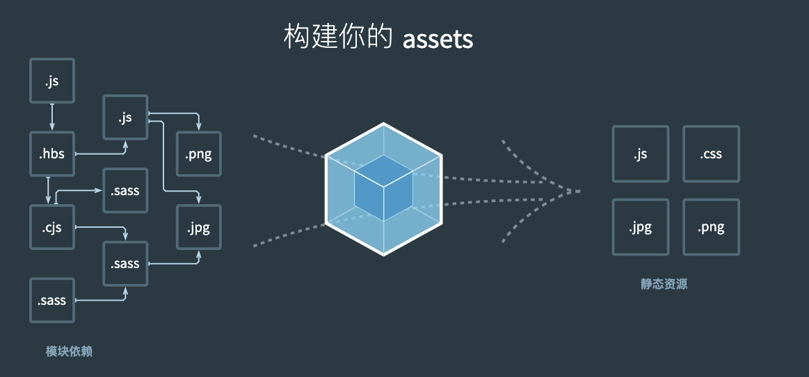

## webpack

组件化开发 vue-cli

webpack 前端工具

前端中的任何资源都称为模块，模块是什么？css js 图片 脚本 表


```本质上，**webpack** 是一个用于现代 JavaScript 应用程序的_静态模块打包工具_。当 webpack 处理应用程序时，它会在内部构建一个 [依赖图(dependency graph)](https://webpack.docschina.org/concepts/dependency-graph/)，此依赖图对应映射到项目所需的每个模块，并生成一个或多个 *bundle*。```



### 历史介绍

-   2009年初，commonjs规范还未出来，此时此刻前端开发人员编写的代码都是非模块化的

    -   那个时候开发人员经常需要十分留意文件加载顺序所带来的依赖问题

    -   ```javascript
        script
        script
        
        
        同步加载，中间有一个环节有问题，就容易造成阻塞
        ```

-   与此同时 nodejs开启了js全栈大门，而requerejs在国外也带动着前端逐步实现模块化

    -   同时国内seajs也进行了大力推广
    -   AMD规范 async module Define，具体实现是requirejs define（'模块id',[模块依赖1,模块依赖2],function(){return ;}) ,ajax请求文件并加载
    -   Commjs || CMD common module Define 规范seajs 淘宝玉伯
        -   commonjs和cmd非常相似的
            -   cmd require/module.exports
        -   commonjs是js在后端语言的规范: 模块、文件操作、操作系统底层
        -   CMD仅仅是模块定义
    -   UMD通用模块定义吗，一种既能兼容amd也能兼容commonjs，也能兼容浏览器环境运行的万能代码

-   npm/bower集中包管理的方式备受青睐，12年browserify/webpack诞生

    -   Npm 是可以下载后端的js代码47500个包
    -   bowwer只能下载前端的js代码, bower在下载bootstrap的时候会自动的下载jquery
    -   browserify解决让require可以运行在浏览器，分析require的关系，组装代码
    -   webpack打包工具，占市场主流

    

CMD在nodejs的环境下

通过module.exports = 变量

通过require('./time.js')

vue更推荐大家使用es6的module

https://es6.ruanyifeng.com/#docs/module


