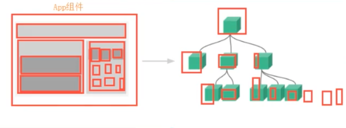

Vue 基于组件化开发

## 14-内容回顾

### 1.es6的基本用法

#### let和const

-   块级作用域
-   不存在变量提升
-   不能重复声明
-   const声明常量，一旦声明不可修改

#### 模板字符串

` ` ${变量名}

#### 箭头函数

1.es5中的函数 this指向 指向了使用该函数的对象

```javascript
var persson = {
    name: 'steven',
    fav:function(){
    	  console.log(this);//this指向person
    }
}
person.fav()
```


2.箭头函数

```javascript
var persson = {
	  name: 'steven',
    fav:()=>{
      console.log(this);//this指向Window
    },
    showName(){
  	  console.log(this);//this指向person
    }
}
person.fav()
```


关于this指向的问题，与vm实例没有任何关系。而是与箭头函数和普通函数的区别。
总结两点：
1、es5的普通函数，this指向是指向了调用者，比如vue实例的方法（在methods中声明了一个方法）是由vue实例vm调用的，所以this指向vm
2、箭头函数的this指向它的调用者看所在的上下文，也就是vm实例所在的上下文（定义vm的父类），即window。

#### 对象

```javascript
class Animal{
    constructor(){
        super()
    }
    showName(){
        
    }
}
```

### 2.vue的基本使用

-   下载 cdn 下载js npm 引包

-   ```javascript
    component组件
    new Vue({
        el:#app,
        data(){ //直接记住函数，不要记对象了。记住一定要写return
        	return {
                
    		}
    	},
        methods:{
            //该组件中声明的方法
        },
        watch:{
            //该组件中监听的单个属性
        },
        computed:{
            
        }
    })
    ```

#### 指令系统

模板语法：{{ xxxx }}

v-html

v-if和v-show

v-for

v-bind :

v-on @

watch

computed 监听 主要产生缓存数据属性，防止DOM性能消耗

## 15-今日内容

### 表单输入绑定

#### 数据双向绑定

>   v-model 只能应用像在 input textarea select
>
>   https://cn.vuejs.org/v2/guide/forms.html

```html
<!DOCTYPE html>
<html lang="zh">
<head>
    <meta charset="UTF-8">
    <meta name="viewport" content="width=device-width, initial-scale=1.0">
    <meta http-equiv="X-UA-Compatible" content="ie=edge">
</head>
<body>
    <div id="app">
        <input type="text" :value="msg" @input="changeHandler">
        <p>{{ msg }}</p>
    </div>
<script src="../vue.js"></script>
<script type="text/javascript">
    //Object.defineProperty() 双向数据绑定使用v-model
    new Vue({
        el:'#app',
        data(){
            return {
                msg:'stevenlee'
            }
        },
        methods:{
            changeHandler(e){
                this.msg = e.target.value
            }
        }
    })
</script>
</body>
</html>
```


### 组件化开发

组件必须都掌握！！！

组件树




### 1.全局组件

### 2.局部组件

​		打油诗：声子 挂子 用子

```html
<!DOCTYPE html>
<html lang="zh">
<head>
    <meta charset="UTF-8">
    <meta name="viewport" content="width=device-width, initial-scale=1.0">
    <meta http-equiv="X-UA-Compatible" content="ie=edge">
    <title></title>
</head>
<body>
    <div id="app">
        {{ msg }}
    </div>
    <script src="../vue.js"></script>
    <script>
        // 如果仅仅是实例化对象中，既有el，又有template,如果template中定义模板的内容
        // 那么template模板的优先级大于el
        new Vue({
            el:"#app",
            data(){
                return {
                    msg:'steven'
                }
            },
            template:`
                <div class="app">
                    <h2>{{ msg }}</h2>
                </div>
            `
           
        })
    </script>
</body>
</html> 
```


### 3.组件的嵌套

​		数据：单向数据

### 4.父子组件

### 5.平行组件传值


